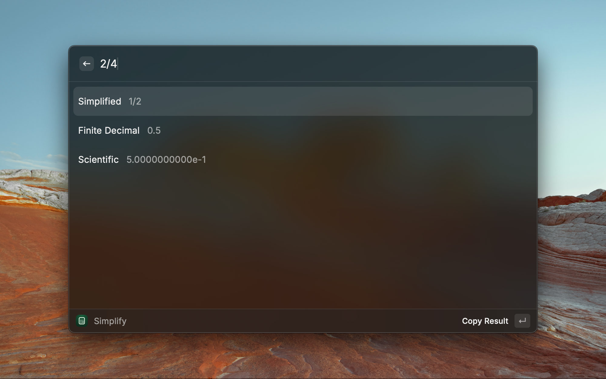

Raycast Extension to simplify fractions, and convert between decimal and fractions.



## Examples

```r
# Simplify Fractions
2/4 => Simplified: 1/2; Finite Decimal: 0.5; Scientific: 5.0e-1
4/6 => Simplified: 2/3; Repeating Decimal: 0.(6), period: 1; Scientific: 6.666666666666667e-1
10/4 => Simplified: 5/2; Finite Decimal: 2.5; Mixed: 2+1/2; Scientific: 2.5e0

# Decimal to Fraction
1.9 => 19/10
1.5 => 3/2
0.3 => 3/10
0.(3) => 1/3
0.(6) => 2/3
0.6... => 2/3
0.6666666 => 3333333/5000000 
0.9999... => 1
0.(9) => 1
0.9999 => 9999/10000
```